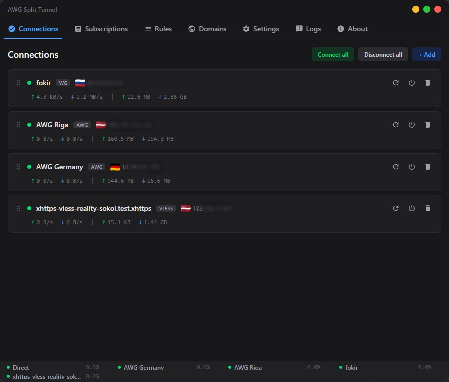
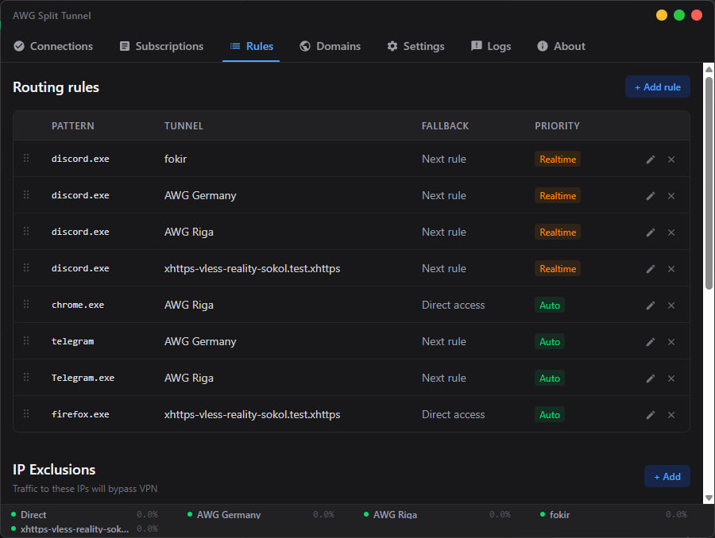
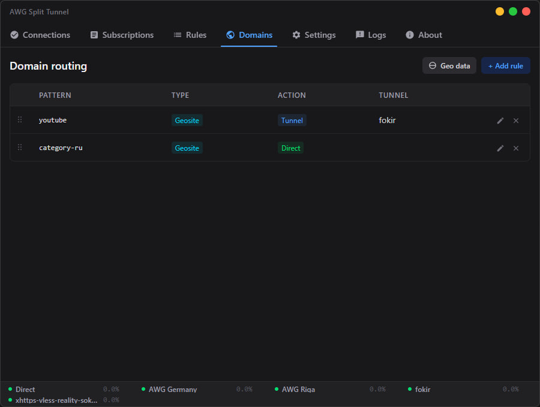
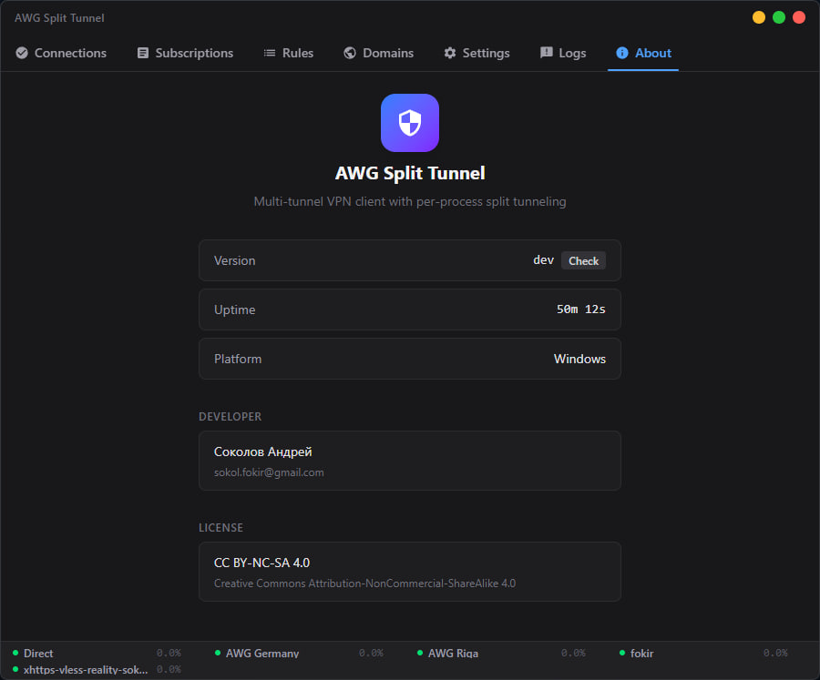

<div align="center">

# AWG Split Tunnel

### Multi-tunnel VPN client with per-process split tunneling

[](https://github.com/Fokir/Ianus-Split-Tunnel-VPN/releases/latest)
[](https://github.com/Fokir/Ianus-Split-Tunnel-VPN)
[](https://go.dev)
[](https://creativecommons.org/licenses/by-nc-sa/4.0/)

**[Download](https://github.com/Fokir/Ianus-Split-Tunnel-VPN/releases/latest)** &nbsp;&middot;&nbsp; **[Configuration](#configuration)** &nbsp;&middot;&nbsp; **[Русский](#-русский)**

---

</div>

## Overview

AWG Split Tunnel is a Windows VPN client that routes application traffic through different VPN tunnels based on per-process rules. Unlike traditional VPN clients that capture all system traffic, AWG Split Tunnel lets you choose exactly which apps go through which tunnel — and which stay on your direct connection.

Run multiple tunnels simultaneously, set fallback policies, prioritize latency-sensitive traffic, and route by domain — all from a single lightweight GUI.

<div align="center">

### Screenshots

</div>

| Connections | Rules |
|:-----------:|:-----:|
|  |  |

| Domain Routing | About |
|:--------------:|:-----:|
|  |  |

## Features

### Multi-Protocol Support

| Protocol | Status | Description |
|----------|--------|-------------|
| **AmneziaWG** | Active | WireGuard with traffic obfuscation (DPI bypass) |
| **WireGuard** | Active | Standard WireGuard tunnels |
| **VLESS** | Active | XTLS-Reality proxy protocol with subscription support |

### Per-Process Split Tunneling

Route each application through its own tunnel with flexible pattern matching:

```yaml
rules:
  - pattern: "firefox.exe"        # Exact executable name
    tunnel_id: awg-germany
    fallback: block                # Kill switch — block if tunnel is down

  - pattern: "chrome"              # Partial name match
    tunnel_id: awg-riga
    fallback: allow_direct         # Fall back to direct connection

  - pattern: 'C:\Games\*'         # Directory glob
    tunnel_id: awg-germany
    fallback: allow_direct

  - pattern: "discord.exe"
    tunnel_id: awg-germany
    priority: realtime             # Low-latency queue for voice/video
```

### Fallback Policies

| Policy | Behavior |
|--------|----------|
| `allow_direct` | Route via real NIC if tunnel is unavailable |
| `block` | Kill switch — drop all traffic if tunnel is down |
| `drop` | Permanently drop traffic |
| `next_rule` | Try the next matching rule in chain |

### Traffic Priority

Assign scheduling priority to rules for QoS-like behavior:

- **Realtime** — voice, video, gaming (minimal latency)
- **Normal** — standard traffic
- **Low** — bulk downloads yield to interactive traffic
- **Auto** — classifies packets automatically (small UDP → high, DNS → high, bulk → normal)

### Domain-Based Routing

Route traffic by domain using GeoSite/GeoIP databases:

```yaml
domain_rules:
  - pattern: "geosite:youtube"     # GeoSite category
    action: tunnel
    tunnel_id: awg-germany

  - pattern: "geosite:category-ru" # Route Russian sites directly
    action: direct
```

### DNS Management

- Per-process DNS routing through VPN tunnels
- Local DNS resolver with caching (`10.255.0.1:53`)
- DNS leak protection via Windows Filtering Platform (WFP)
- Parallel queries to multiple upstream servers

### Additional Capabilities

- **Multiple simultaneous tunnels** with real-time TX/RX statistics
- **VLESS subscriptions** with auto-refresh
- **Auto-reconnect** with configurable retry intervals
- **Global IP/app exclusions** — bypass VPN for specific IPs or apps
- **Per-tunnel filters** — allowed/disallowed IPs and apps per tunnel
- **Local network bypass** — RFC 1918 / link-local automatically excluded
- **Auto-update** — periodic checks against GitHub Releases
- **Windows Service mode** — run headless via SCM
- **Hot config reload** — apply YAML changes without restart
- **Bilingual UI** — English and Russian

## Installation

### Installer (recommended)

1. Download **[awg-split-tunnel-ui-amd64-installer.exe](https://github.com/Fokir/Ianus-Split-Tunnel-VPN/releases/latest)** from the latest release
2. Run the installer
3. Launch **AWG Split Tunnel** from the Start Menu

### Portable

1. Download **[awg-split-tunnel-\*-windows-amd64.zip](https://github.com/Fokir/Ianus-Split-Tunnel-VPN/releases/latest)** from the latest release
2. Extract to any directory
3. Run `awg-split-tunnel.exe`

### Command Line

```bash
# Run with custom config
awg-split-tunnel -config path/to/config.yaml

# Install as Windows Service
awg-split-tunnel install -config path/to/config.yaml

# Service management
awg-split-tunnel start
awg-split-tunnel stop
awg-split-tunnel uninstall
```

> **Note:** Administrator privileges are required — the application manages network adapters and WFP filters.

## Configuration

AWG Split Tunnel uses a single YAML configuration file. See [`config.example.yaml`](config.example.yaml) for the full reference.

### Minimal Example

```yaml
tunnels:
  - id: awg-germany
    protocol: amneziawg
    name: "AWG Germany"
    settings:
      config_file: "germany.conf"

rules:
  - pattern: "firefox.exe"
    tunnel_id: awg-germany
    fallback: block

dns:
  tunnel_id: awg-germany
  servers:
    - "1.1.1.1"
    - "8.8.8.8"
```

### Key Sections

| Section | Purpose |
|---------|---------|
| `global` | IP/app filters applied to all tunnels |
| `tunnels` | VPN tunnel definitions (protocol, config file, filters) |
| `rules` | Process → tunnel routing rules with fallback policies |
| `domain_rules` | Domain-based routing via GeoSite/GeoIP |
| `dns` | DNS resolver settings, cache, leak protection |
| `subscriptions` | VLESS subscription URLs with auto-refresh |
| `logging` | Log levels (global and per-component) |
| `gui` | UI preferences, auto-connect, reconnect settings |
| `update` | Auto-update check interval |

## Architecture

```
┌─────────────────────────────────────────────────────────┐
│                      GUI (Svelte)                       │
│              Wails v3  ←→  gRPC bindings                │
└──────────────────────┬──────────────────────────────────┘
                       │
┌──────────────────────▼──────────────────────────────────┐
│                    Core Service                         │
│  ConfigManager · EventBus · TunnelRegistry · RuleEngine │
└──────┬────────────┬────────────────┬────────────────────┘
       │            │                │
┌──────▼──────┐ ┌───▼─────────┐ ┌───▼──────────────┐
│   Gateway   │ │  Providers  │ │   Proxy Layer    │
│             │ │             │ │                  │
│ WinTUN      │ │ AmneziaWG   │ │ TCP Transparent  │
│ WFP Manager │ │ WireGuard   │ │ UDP Transparent  │
│ Flow Table  │ │ VLESS       │ │ SNI Extraction   │
│ DNS Resolver│ │ Direct      │ │ Fallback Router  │
│ Route Mgr   │ │             │ │                  │
│ IP Filter   │ │             │ │                  │
└─────────────┘ └─────────────┘ └──────────────────┘
```

**How it works:**

1. A **WinTUN virtual adapter** captures all routed traffic
2. **WFP filters** block per-process access to the real NIC, forcing traffic through TUN
3. The **packet router** identifies the source process for each packet
4. The **rule engine** matches the process against routing rules
5. Matched traffic is **raw-forwarded** to the appropriate VPN tunnel
6. Unmatched traffic follows the **fallback policy** (direct, block, or next rule)
7. **DNS queries** are intercepted and routed per-process through VPN resolvers

## Building from Source

### Prerequisites

- Go 1.25+
- [Wails v3](https://wails.io) (for GUI)
- Node.js 18+ (for frontend)
- Windows SDK (for WFP headers)

### Build

```bash
# Backend only (headless service)
make build

# GUI application
cd ui && wails3 build

# All binaries (service + updater + diagnostics)
make all
```

## Tech Stack

| Layer | Technology |
|-------|-----------|
| Backend | Go 1.25 |
| Frontend | Svelte + Tailwind CSS |
| Desktop Framework | Wails v3 |
| IPC | gRPC + Protocol Buffers |
| VPN Protocol | AmneziaWG / WireGuard (netstack) |
| Proxy Protocol | VLESS (via xray-core) |
| Network | WinTUN adapter + WFP (Windows Filtering Platform) |
| NAT | 64-shard concurrent flow tables |

## License

This project is licensed under [CC BY-NC-SA 4.0](https://creativecommons.org/licenses/by-nc-sa/4.0/).

---

<div align="center">

# <a id="-русский"></a>Русский

</div>

---

## Обзор

AWG Split Tunnel — VPN-клиент для Windows с раздельной маршрутизацией трафика по процессам. В отличие от обычных VPN-клиентов, которые захватывают весь системный трафик, AWG Split Tunnel позволяет точно выбирать, какие приложения идут через какой туннель, а какие остаются на прямом подключении.

Запускайте несколько туннелей одновременно, настраивайте политики отката, приоритизируйте чувствительный к задержкам трафик и маршрутизируйте по доменам — всё из одного компактного интерфейса.

## Возможности

### Поддержка протоколов

| Протокол | Статус | Описание |
|----------|--------|----------|
| **AmneziaWG** | Активен | WireGuard с обфускацией трафика (обход DPI) |
| **WireGuard** | Активен | Стандартные WireGuard-туннели |
| **VLESS** | Активен | Прокси-протокол XTLS-Reality с поддержкой подписок |

### Раздельная маршрутизация по процессам

Направляйте каждое приложение через свой туннель с гибким сопоставлением:

```yaml
rules:
  - pattern: "firefox.exe"        # Точное имя исполняемого файла
    tunnel_id: awg-germany
    fallback: block                # Kill switch — блокировать при недоступности туннеля

  - pattern: "chrome"              # Частичное совпадение
    tunnel_id: awg-riga
    fallback: allow_direct         # Прямое подключение как запасной вариант

  - pattern: 'C:\Games\*'         # Шаблон по каталогу
    tunnel_id: awg-germany

  - pattern: "discord.exe"
    tunnel_id: awg-germany
    priority: realtime             # Очередь с низкой задержкой для голоса/видео
```

### Политики отката

| Политика | Поведение |
|----------|-----------|
| `allow_direct` | Маршрутизация через реальный адаптер при недоступности туннеля |
| `block` | Kill switch — сбросить весь трафик при недоступности туннеля |
| `drop` | Безусловная блокировка трафика |
| `next_rule` | Перейти к следующему совпадающему правилу |

### Приоритизация трафика

- **Realtime** — голос, видео, игры (минимальная задержка)
- **Normal** — обычный трафик
- **Low** — массовые загрузки уступают интерактивному трафику
- **Auto** — автоматическая классификация пакетов

### Маршрутизация по доменам

Маршрутизация трафика по доменам через базы GeoSite/GeoIP:

```yaml
domain_rules:
  - pattern: "geosite:youtube"     # Категория GeoSite
    action: tunnel
    tunnel_id: awg-germany

  - pattern: "geosite:category-ru" # Российские сайты напрямую
    action: direct
```

### Управление DNS

- Маршрутизация DNS-запросов по процессам через VPN-туннели
- Локальный DNS-резолвер с кэшированием (`10.255.0.1:53`)
- Защита от DNS-утечек через Windows Filtering Platform (WFP)
- Параллельные запросы к нескольким серверам

### Дополнительные возможности

- **Несколько туннелей одновременно** со статистикой TX/RX в реальном времени
- **Подписки VLESS** с автообновлением
- **Автопереподключение** с настраиваемыми интервалами
- **Глобальные исключения** по IP и приложениям
- **Фильтры на туннель** — разрешённые/запрещённые IP и приложения
- **Обход локальной сети** — RFC 1918 / link-local исключаются автоматически
- **Автообновление** — периодическая проверка релизов на GitHub
- **Режим службы Windows** — работа через SCM без GUI
- **Горячая перезагрузка конфигурации** — применение изменений YAML без перезапуска
- **Двуязычный интерфейс** — английский и русский

## Установка

### Установщик (рекомендуется)

1. Скачайте **[awg-split-tunnel-ui-amd64-installer.exe](https://github.com/Fokir/Ianus-Split-Tunnel-VPN/releases/latest)** из последнего релиза
2. Запустите установщик
3. Откройте **AWG Split Tunnel** из меню «Пуск»

### Портативная версия

1. Скачайте **[awg-split-tunnel-\*-windows-amd64.zip](https://github.com/Fokir/Ianus-Split-Tunnel-VPN/releases/latest)** из последнего релиза
2. Распакуйте в любую папку
3. Запустите `awg-split-tunnel.exe`

### Командная строка

```bash
# Запуск с пользовательским конфигом
awg-split-tunnel -config path/to/config.yaml

# Установка как служба Windows
awg-split-tunnel install -config path/to/config.yaml

# Управление службой
awg-split-tunnel start
awg-split-tunnel stop
awg-split-tunnel uninstall
```

> **Примечание:** Требуются права администратора — приложение управляет сетевыми адаптерами и WFP-фильтрами.

## Конфигурация

AWG Split Tunnel использует единый YAML-файл конфигурации. Полный пример — [`config.example.yaml`](config.example.yaml).

### Минимальный пример

```yaml
tunnels:
  - id: awg-germany
    protocol: amneziawg
    name: "AWG Germany"
    settings:
      config_file: "germany.conf"

rules:
  - pattern: "firefox.exe"
    tunnel_id: awg-germany
    fallback: block

dns:
  tunnel_id: awg-germany
  servers:
    - "1.1.1.1"
    - "8.8.8.8"
```

### Основные секции

| Секция | Назначение |
|--------|-----------|
| `global` | IP/app-фильтры, применяемые ко всем туннелям |
| `tunnels` | Определения VPN-туннелей (протокол, конфиг, фильтры) |
| `rules` | Правила маршрутизации процесс → туннель с политиками отката |
| `domain_rules` | Доменная маршрутизация через GeoSite/GeoIP |
| `dns` | Настройки DNS-резолвера, кэш, защита от утечек |
| `subscriptions` | URL подписок VLESS с автообновлением |
| `logging` | Уровни логирования (глобально и по компонентам) |
| `gui` | Настройки интерфейса, автоподключение, реконнект |
| `update` | Интервал проверки автообновлений |

## Лицензия

Проект распространяется под лицензией [CC BY-NC-SA 4.0](https://creativecommons.org/licenses/by-nc-sa/4.0/).
